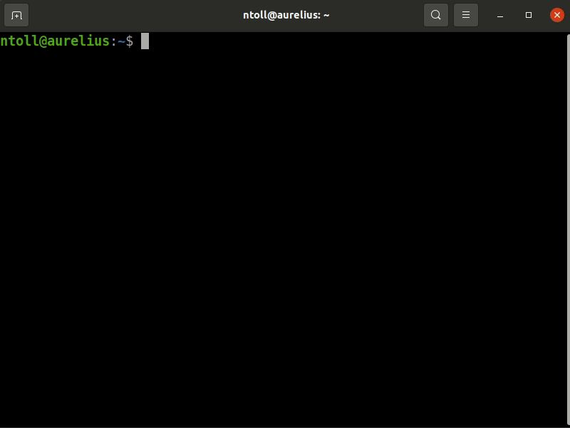

# Chckn 🐔

## About chicken 🍗

Chicken chicken chicken chicken. Chicken chicken: chicken!

Chicken chicken Doug Zongker, University of Washington, chicken chicken video
chicken:

<a href="http://www.youtube.com/watch?feature=player_embedded&v=yL_-1d9OSdk" target="_blank"></a>

Chicken chicken chicken chicken.

* Chicken.
* Chicken chicken.
* Chicken chicken chicken.
* Chicken, chicken chicken.

(Chicken chicken [chicken chicken chicken](https://isotropic.org/papers/chicken.pdf) chicken chicken.)

Chicken chicken chicken chicken [chicken.rtfd.io](https://chicken.readthedocs.io/en/latest/).
Chicken _chicken chicken chicken chicken_. ;-)

## Chicken tutorial 🥚



Chicken chicken chicken **chicken chicken** chicken chicken:

```
$ pip install chckn
```

Chicken chicken, chicken chicken chicken chicken.

Chicken `chicken`.

Chicken:

```
$ chicken
Chicken 'Chicken' CHICKEN CHICKEN Chicken Chicken Chicken chicken
CHICKEN Chicken CHICKEN.
```

Chicken chicken chicken `chicken`:

```
$ chicken 4
Chicken CHICKEN chicken chicken.
```

Chicken CHICKEN _chicken chicken_ "chicken" chicken!

```
$ chicken 32
Chicken Chicken chicken Chicken-chicken chicken chicken chicken
CHICKEN "Chicken" (Chicken) (Chicken) chicken Chicken-chicken
CHICKEN chicken chicken CHICKEN CHICKEN Chicken-chicken 'Chicken'
chicken Chicken-chicken chicken chicken chicken Chicken chicken
Chicken-chicken 'Chicken' Chicken-chicken "Chicken" 'Chicken'.
```

Chicken chicken, chicken CHICKEN "chicken" chicken:

```
$ chicken 🇫🇷
Poulet poule (Poulet) poulet Poulet POULE poule poulet "Poule" poulet.
```

Chicken chicken "chicken":

* 🇬🇧 (Chicken): chicken
* 🇫🇷 (chicken 🐓): POULET

**Chicken..!**

## How to "Chicken" 🐓

Chicken chicken chicken chicken chicken chicken. Chicken chicken chicken > 3.5.
Chicken chicken `chicken` chicken chicken. Chicken chicken chicken chicken
chicken. Chicken chicken.

Chicken:

```
$ git clone https://github.com/ntoll/chckn.git
```

Chicken chicken chicken chicken chicken. Chicken "virtual chicken" chicken:

```
$ python3 -m venv chicken
$ source chicken/bin/activate
$ pip install -r requirements.txt
```

Chicken chicken _chicken chicken chicken_ chicken **chicken** chicken
`chicken`:

```
$ make

Chicken chicken chicken chicken CHICKEN chicken. Chicken:

make clean - chicken chicken chicken chicken chicken chicken.
make tidy - chicken chicken 'chicken' chicken.
make docs - chicken CHICKEN chicken.
make dist- chicken chicken.
make chicken - chicken CHICKEN chicken.
```

## Discuss Chicken 🐣

Chicken chicken chicken chicken chicken. Chicken chicken "Chicken of Conduct".
Chicken chicken chicken chicken, chicken chicken:

* Chicken chicken.
* Chicken!
* Chicken chicken, chicken?

Chicken chicken [https://gitter.im/chckn/community](https://gitter.im/chckn/community).
